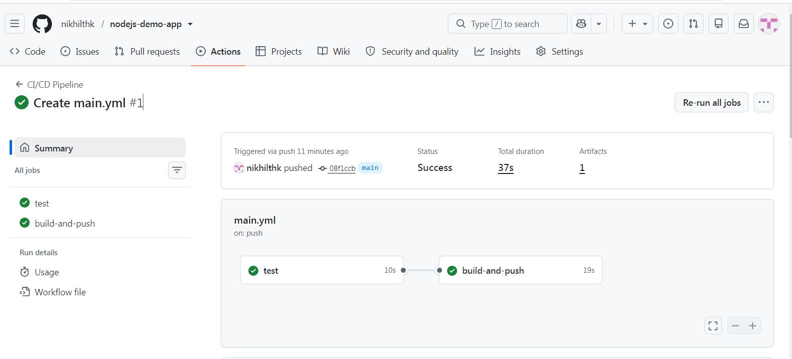
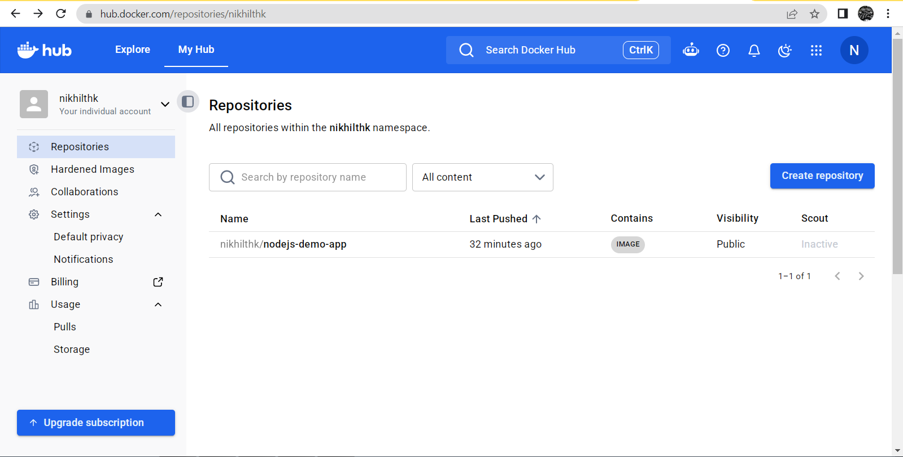

# Node.js Demo App - CI/CD with GitHub Actions

## Objective
Automate build and deployment of a Node.js web app using a CI/CD pipeline.

## Tools Used
GitHub, GitHub Actions, Node.js, Docker, Docker Hub

## How It Works
The workflow `.github/workflows/main.yml` runs on every push to `main`:
1. **test** job: installs dependencies and runs tests
2. **build-and-push** job: logs in to Docker Hub, builds the Docker image and pushes it

Docker Hub credentials are stored securely in GitHub Secrets
(`DOCKERHUB_USERNAME`, `DOCKERHUB_TOKEN`).

## Project Files
- `app.js` - Express web app
- `test.js` - simple test
- `Dockerfile` - container build instructions
- `.github/workflows/main.yml` - CI/CD pipeline

## Result
Pipeline success:

Image on Docker Hub:

## What I Learned
How to automate test, build and push using GitHub Actions and Docker.
